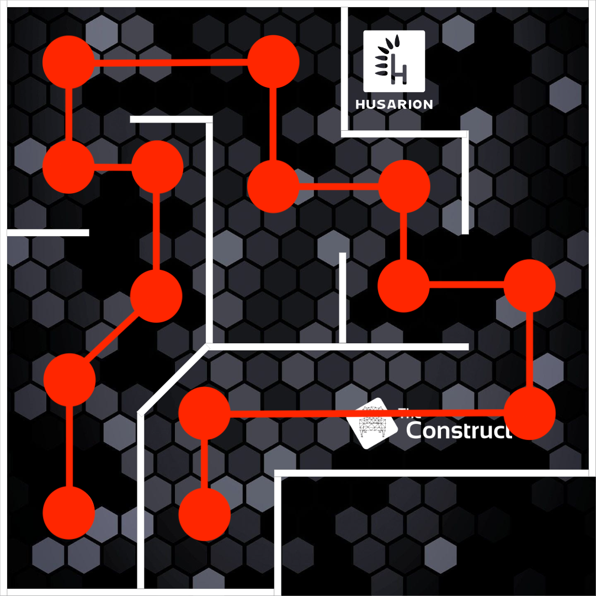
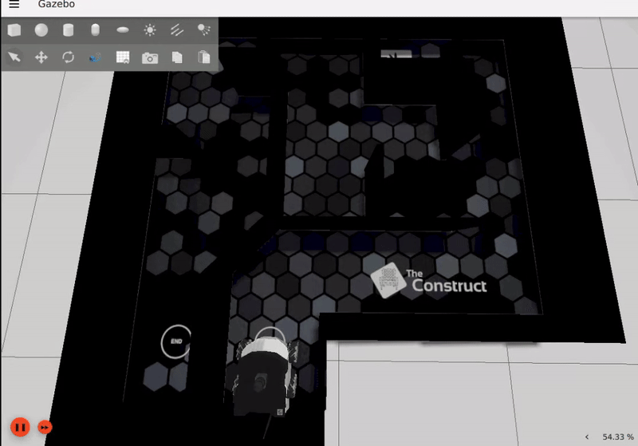
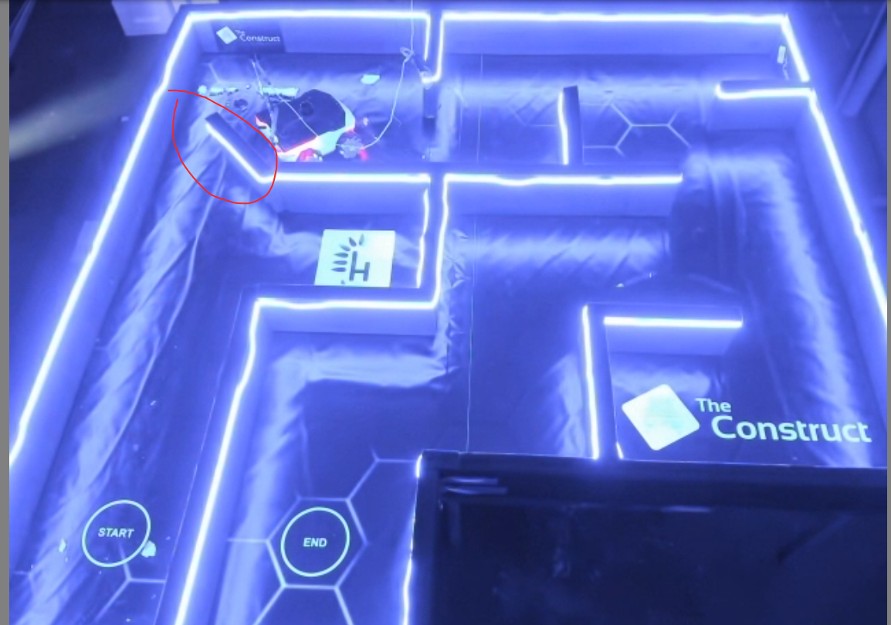

# checkpoint17_pid_maze_solver

## Part 4 Solve the Simulated maze






Fine tuning PID
best value so far

        Kp = 1.4;
        Ki = 0.05;
        Kd = 0;
        Kp_angle = 1.2;
        Ki_angle = 0.005; 
        Kd_angle = 0.005; 


## to repeat the last success
Terminal 1
```
cd ~/ros2_ws && colcon build && source install/setup.bash
ros2 launch rosbot_xl_gazebo simulation.launch.py
```

Terminal 2
```
cd ~/ros2_ws && colcon build 
source install/setup.bash ; ros2 run pid_maze_solver pid_maze_solver 1
```

If you want to reverse solving the simulated maze
Terminal 2
```
cd ~/ros2_ws && colcon build 
source install/setup.bash ; ros2 run pid_maze_solver pid_maze_solver -1
```

## Part 5 Solve the Real robot Cyberworld maze  ( In progress....)




Fine tuning PID
best value so far

        Kp = 0.5;
        Ki = 0;
        Kd = 0;
        Kp_angle = 0.5;
        Ki_angle = 0;
        Kd_angle = 0;


Helper commands
```
ros2 topic echo /odometry/filtered --field pose.pose.position
```
```
ros2 topic echo /rosbot_xl_base_controller/odom --field pose.pose.position
```